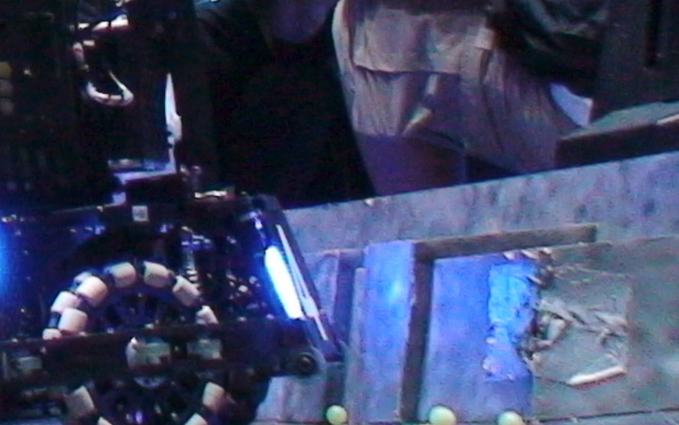

## 第二次任务
### 安装OpenCV库
从git上clone源码后使用cmake编译安装即可

安装过程中，由于本机安装了anaconda导致编译失败，修改相关配置文件后就能够成功编译安装

---

### 图像处理操作
基本在第二次培训文档中都有，没有什么需要特别关注的，代码中给出了必要的注释

在 ./src/main.cpp 中只对测试图像进行了相应的处理，和注释一一对应，我将``imshow()``的代码都注释掉了。如果需要查看效果，取消对应那几行的注释即可

此处对教程没有说明的几个操作做一些记录


##### 1. 漫水处理(``cv::floodFill()``)
###### 介绍 

漫水处理的效果在[OpenCV官方文档](https://docs.opencv.org/4.x/d7/d1b/group__imgproc__misc.html#ga366aae45a6c1289b341d140839f18717 "点击跳转官方文档")中是这么说的:

> Fills a connected component with the given color.

基本意思就是将相连的部分用指定颜色去填充

那么什么是相连的部分呢？和周围已知 相连于seed point的点 的 差值在一定范围内，那么我们就认为这个点也和seed point相连

###### 源码
这就是漫水处理
<br>
在main.cpp中，实现对测试图片漫水处理的源码如下

```cpp
cv::Mat floodFillImg;
src1.copyTo(floodFillImg);
cv::Rect zeroRec;
cv::floodFill(floodFillImg, cv::Point(cv::Size(1,1)), cv::Scalar(0,255,0),&zeroRec, cv::Scalar(3,3,3),cv::Scalar(3,3,3));cv::imshow("floodFill Img", floodFillImg);
cv::waitKey(0);
```

主要解释关键代码，floodFill操作
该函数默认在传入的图片上进行操作，我们首先传入``floodFillImg``作为待操作的矩阵，第二个传入的是seed point，我指定为图片的左上角，也就是天空的一部分，然后设定上下限，这样floodFill操作就可以把天空的颜色换成指定的颜色，也就是我在上面指定的绿色（0,255,0）


##### 2. 旋转和裁剪
旋转和裁切较为简单

###### 旋转

源码如下

```cpp
cv::Mat rotatedMat= cv::getRotationMatrix2D(cv::Point(640,360), 35, 1);
cv::Mat rotatedImg;
cv::warpAffine(src1, rotatedImg, rotatedMat, src1.size());cv::imshow("rotated Img", rotatedImg);
cv::waitKey(0);
```

要实现旋转需要先定义好旋转用的矩阵，传入旋转中心，以及旋转角度，还有缩放的倍率

然后将旋转矩阵传入仿射变换的函数中就可以实现图片旋转

###### 裁剪

源码如下

```cpp
cv::Mat cutImg = src1(cv::Range(0,(src1.size().height)/2),cv::Range(0, src1.size().width/2));
cv::imshow("Cut Img", cutImg);
cv::waitKey(0);
```

裁剪更加简单，只要选取图片的一部分即可

--- 

### 识别装甲板
本次任务的重点是对装甲板的识别，主要是识别装甲板的指示灯

##### 实现思路

###### 颜色筛选
注意到装甲板两边有高亮度的蓝色指示灯，我们考虑综合颜色和亮度来进行筛选

在 main.cpp 中，我们读取图片后先进行了一个滤波，然后将三个通道分离（三个通道按照索引分别是BGR）

为了综合考虑亮度和蓝色这两个要素，我们通过对三个通道加权平均得到一个新的矩阵。权重分别是：B 80%, G 10%, R 10%
之所以需要加权平均（也就是综合考虑亮度和蓝色），是因为如果只考虑蓝色，图中部分被指示灯照亮的部分（如下图所示）会被错误的识别：



同理，如果只考虑亮度，那么图中高亮度的衣服也会被错误识别

综上，我认为加权平均是比较好的办法

###### 二值化 & 开运算
对刚刚得到的矩阵应用二值化和开运算，可以初步做到一个筛选

###### 轮廓提取和筛选
完成上述初步筛选后，我们对轮廓进行提取，使用``findContours()``函数，将轮廓和表示结构的数组（可以通过这个数组访问节点的父子节点等）存储起来，然后通过for循环遍历外轮廓，思路如下：

从索引i为0开始，每次循环结束将索引赋值为 数组的[i][0]元素，也就是下一个轮廓的索引
对于每一个轮廓，获取它的最小面积外接矩形（旋转）``rotRect``，以及它的boundingRect （存储在``rec``中）,如果``rotRect``的面积较大，而且和``rec``的比值较大的话就认为是装甲板上的灯条（灯条面积较大，而且由于几乎是垂直的所以上述的比值也比较大）

如此我们实现了对灯条的识别

接下去我们要绘制一个大致的装甲板，获取灯条外接矩形的四个端点，选取左边灯条的左上端点稍向上平移和右边灯条的右下端点稍向下平移作矩形，大致就是装甲板的范围

###### 存储图像
最后将标出装甲板的图像存储在``"resources/ArmorRecognized.jpg"``即可


